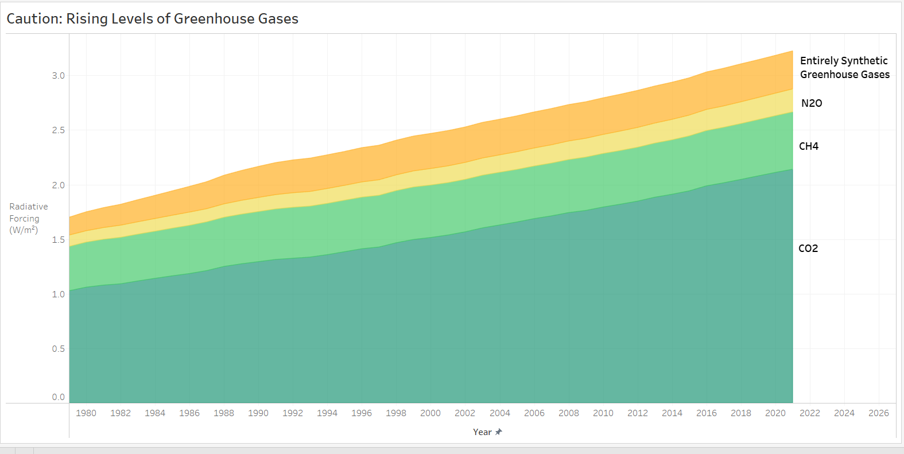

| [home page](https://cmustudent.github.io/tswd-portfolio-templates/) | [visualizing debt](visualizing-government-debt) | [critique by design](critique-by-design) | [final project I](final-project-part-one) | [final project II](final-project-part-two) | [final project III](final-project-part-three) |

# Critique by Design with Tableau (MakeoverMonday)

## Step one: the visualization

Data Source: https://data.world/makeovermonday/2023w1

I chose to redesign this visualization of data for two main reasons. First, I am interested in environmental data, especially data that elucidates the effects of greenhouse gases over time, which is why I chose it. Second, the initial visualization of the graph presented a challenge to direct understanding due to its two-axis configuration and the lack of a clear explanation of the units of measurement on the y-axis. This complexity can obscure the important information and data insights it is supposed to convey, and is therefore the best candidate for redesign to improve clarity and accessibility.

## Step two: the critique

The strength of this chart is that it effectively communicates complex data in a straightforward manner, using clear, distinguishable lines to represent various data trends. This enhances its utility and realism, ensuring that key environmental data are accurately communicated. However, due to its dual-axis design, and the difficulty in understanding the data in vertical coordinates, the chart struggles with intuitiveness and perceivability, which may confuse viewers unfamiliar with this type of layout. While the chart maintains a clean aesthetic, it lacks an engaging element to appeal to a wider audience or encourage further interaction with the data.

## Step three: Sketch a solution

## Step four: Test the solution

_Before you conduct your interviews, prepare a simple script.  Use this as a guide and as a way to take notes as you go forward. Come up with your own list of questions you want to ask for the selected visualization. Keep the questions broad so you can get the most value out of your feedback. Then, document answers to your questions here._

Questions to ask (modify these for your own interviews): 

- Can you tell me what you think this is?

- Can you describe to me what this is telling you?

- Is there anything you find surprising or confusing?

- Who do you think is the intended audience for this?

- Is there anything you would change or do differently?

Results: 

_Don't identify or share personally identifiable information (PII) about the people you spoke to._

| Question | Interview 1 | Interview 2 |
|----------|-------------|-------------|
|          |             |             |
|          |             |             |
|          |             |             |

Synthesis: 

_What patterns in the feedback emerge?  What did you learn from the feedback?  Based on this feedback, come up with what design changes you think might make the most sense in your final redesign._

## Step five: build the solution

_Include and describe your final solution here. It's also a good idea to summarize your thoughts on the process overall. When you're done with the assignment, this page should all the items mentioned in the assignment page on Canvas(a link or screenshot of the original data visualization, documentation explaining your process, a summary of your wireframes and user feedback, your final, redesigned data visualization, etc.)._

